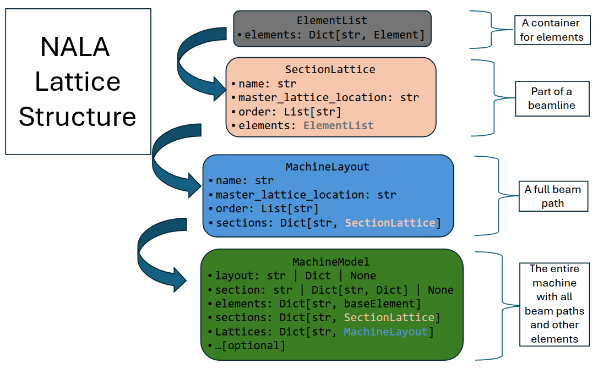

# NALA: Not Another Lattice Architecture

**NALA** is a Python package for describing, simulating, and controlling particle accelerator lattices. It provides a standardized, extensible data model for elements, sections, layouts, and full machine models.

---

## Architecture Overview

NALA organizes accelerator elements using a hierarchical structure:

### Element Structure


- **baseElement**: Core identification (name, hardware_class, hardware_type, machine_area)
- **Element**: Extends with simulation, controls, electrical, manufacturer info
- **PhysicalBaseElement**: Adds position, rotation, length, error, survey

### Lattice Structure



- **ElementList**: Container for elements
- **SectionLattice**: Ordered list of elements (a section of the beamline)
- **MachineLayout**: Sequence of sections (a full beam path)
- **MachineModel**: All layouts, sections, and elements (the full accelerator)

---

## Quick Examples

### Create a Basic Element

```python
from nala.models.element import baseElement

element = baseElement(
    name="QUAD-01",
    hardware_class="Magnet",
    hardware_type="Quadrupole",
    machine_area="LINAC-1"
)
print(element.name)  # "QUAD-01"
```

### Element with Physical Properties

```python
from nala.models.element import PhysicalBaseElement
from nala.models.physical import PhysicalElement, Position

cavity = PhysicalBaseElement(
    name="CAV-01",
    hardware_class="RF",
    hardware_type="Cavity",
    machine_area="LINAC-1",
    physical=PhysicalElement(
        length=1.0,
        middle=Position(x=0, y=0, z=5.0)
    )
)
print(cavity.physical.length)  # 1.0
```

### Create a Section Lattice

```python
from nala.models.elementList import SectionLattice, ElementList

section = SectionLattice(
    name="INJECTOR",
    order=["BPM-01", "QUAD-01"],
    elements=ElementList(elements={
        "BPM-01": element,
        "QUAD-01": cavity
    })
)
print(section.names)  # ["BPM-01", "QUAD-01"]
```

### Build a Machine Layout

```python
from nala.models.elementList import MachineLayout

layout = MachineLayout(
    name="MainBeamline",
    sections={"INJECTOR": section}
)
print(layout.names)  # ["INJECTOR"]
```

### Full Machine Model

```python
from nala.models.elementList import MachineModel

model = MachineModel(
    elements={"QUAD-01": element, "CAV-01": cavity}
)
print(list(model.sections.keys()))  # ["LINAC-1"]
```

---

## Translator Module

NALA includes a translator system for exporting accelerator models to various simulation codes, 
such as ASTRA, GPT, Elegant, CSRTrack, Ocelot, Xsuite, Wake-T, and Genesis.

- Translate individual elements, sections, layouts, or full machine models.
- Export to code-specific formats and objects.
- Automatically manage drift spaces, field maps, and code-specific configuration.

**Example: Export a section to Elegant and Ocelot**

```python
from nala.translator.converters.section import SectionLatticeTranslator

translator = SectionLatticeTranslator.from_section(section)
translator.directory = "./output"

elegant_string = translator.to_elegant(charge=1e-9)
ocelot_lattice = translator.to_ocelot(save=True)
```

See the [Translator documentation](docs/source/Translator.rst) for details and more examples.

---

## Features

- **Hierarchical lattice structure**: elements → sections → layouts → machine
- **Flexible element definition**: physical, simulation, controls, electrical, manufacturer
- **Extensible API**: add new element types and metadata
- **Simulation & controls integration**: store simulation parameters and control variables
- **Export to simulation codes** via the Translator module

---

---

## Installation

Install NALA from PyPI:

```bash
pip install nala-accelerator
```

Or add to your `requirements.txt`:

```
nala-accelerator
```

## Documentation

- [Element Definition](docs/source/Architecture/Element.rst)
- [Lattice Structure](docs/source/Architecture/Lattice.rst)
- [Translator Module](docs/source/Translator.rst)
- [Examples](docs/source/Examples.rst)

---

## Contributing

Issues and pull requests are welcome! See [GitHub Issues](https://github.com/astec-stfc/nala/issues).

---