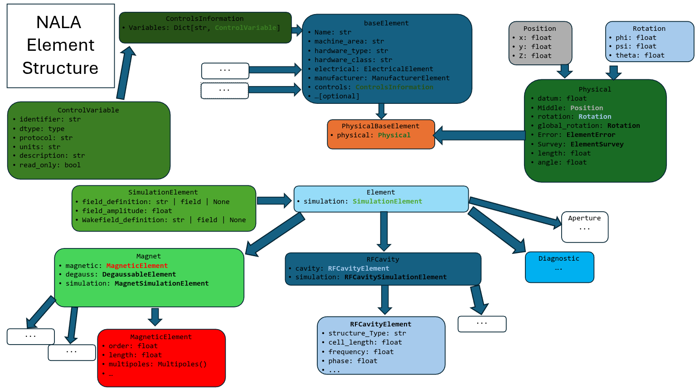

.. _element:

Element Definition
==================

Accelerator elements in :mod:`NALA` are based on a hierarchical structure. All elements must define some common
properties in order to identify their type, machine_area, and other fields.
From this base level, additional details can be added progressively depending on the element type and its
intended use.

These generic classes are outlined below; refer to :numref:`fig-element-structure` for an inheritance diagram.

.. _fig-element-structure:

   Class structure of :mod:`NALA` elements.

.. _base-element:

Base-level element
------------------

All elements in a :mod:`NALA` lattice derive from the :py:class:`baseElement <nala.models.element.baseElement>`
class. At a minimum, each element must define:

* ``name: str``: The (unique) name of the element.
* ``hardware_class: str``: The generic type of the element. 
* ``hardware_type: str``: The element type. For example, a ``Quadrupole`` has ``hardware_type='Quadrupole'`` and ``hardware_class='Magnet'``. 
* ``machine_area: str``: Used for dividing the lattice into sections based on position.

The following additional properties can also be provided:

* ``hardware_model: str``: A specific model type of an element, for example the manufacturer name.
* ``virtual_name: str``: The name of the element in the virtual control system (if it exists).
* ``alias: str | list``: Alternative name(s) for the element.
* ``subelement: bool``: Represents whether the element 'belongs' to another, i.e. if they overlap in physical space, such as a wakefield attached to a cavity or a solenoid magnet around an RF photoinjector.

While most elements that are typically considered part of an accelerator lattice are defined with reference to a
fiducial position, and therefore are described in physical space with respect to that position, not all
elements supported by the :mod:`NALA` standard need to have their position defined.
Objects that control lighting, low-level RF modules, RF modulators, or feedback systems, are all examples of
elements that derive from :py:class:`baseElement <nala.models.element.baseElement>`
but do not have a physical position defined.

**Example:** Creating a basic element without physical position:

.. code-block:: python

    from nala.models.element import baseElement

    # RF modulator - no physical position needed
    modulator = baseElement(
        name="MOD-KLYS-01",
        hardware_class="RF",
        hardware_type="Modulator",
        hardware_model="ScandiNova-K100",
        machine_area="KLYSTRON_GALLERY",
        virtual_name="MOD:KLYS:01",
        alias=["mod1", "klystron_mod_1"]
    )

    # BPM embedded in a quadrupole (subelement)
    embedded_bpm = baseElement(
        name="BPM-QUAD-01",
        hardware_class="Diagnostic",
        hardware_type="BPM",
        machine_area="LINAC-1",
        subelement=True
    )

.. _physical-element:

Physical element
----------------

The :py:class:`PhysicalBaseElement <nala.models.element.PhysicalBaseElement>` class derives from
:py:class:`baseElement <nala.models.element.baseElement>`, with the additional ``physical`` property based on
the :py:class:`PhysicalElement <nala.models.physical.PhysicalElement>` class.
This allows the position and rotation of the element in Cartesian co-ordinates to be defined. 
Furthermore, elements can be specified with ``error`` and ``survey`` attributes, both of which define a ``position`` and ``rotation``.

The full specification of an element position therefore consists of:

* ``position: Position(x, y, z)`` -- this refers to the middle of the element.
* ``global_rotation: Rotation(phi, psi, theta)``
* ``length: float``
* ``angle: float`` -- this is a simplified way of retrieving the bend angle in the X-Z plane.
* ``error: ElementError(position=Position(x, y, z), rotation=Rotation(phi, psi, theta))`` -- see :py:class:`ElementError <nala.models.physical.ElementError>`; the reference position for an error is the middle of the element.
* ``survey: ElementSurvey(position=Position(x, y, z), rotation=Rotation(phi, psi, theta))`` -- see :py:class:`ElementSurvey <nala.models.physical.ElementSurvey>`.

**Example:** Creating elements with physical properties:

.. code-block:: python

    from nala.models.element import PhysicalBaseElement
    from nala.models.physical import PhysicalElement, Position, Rotation, ElementError

    # Quadrupole with position and alignment error
    quad = PhysicalBaseElement(
        name="QUAD-02",
        hardware_class="Magnet",
        hardware_type="Quadrupole",
        machine_area="LINAC-1",
        physical=PhysicalElement(
            length=0.5,
            middle=Position(x=0, y=0, z=10.0),
            error=ElementError(
                position=Position(x=0.0001, y=-0.0002, z=0),  # 0.1mm X, -0.2mm Y offset
                rotation=Rotation(phi=0, psi=0, theta=0.001)  # 1 mrad roll
            )
        )
    )

    # Access computed positions
    print(f"Quad start: {quad.physical.start.z}")  # 9.75
    print(f"Quad end: {quad.physical.end.z}")      # 10.25

.. _element-class:

Element
-------

On top of the :py:class:`PhysicalBaseElement <nala.models.element.PhysicalBaseElement>`, additional information
pertaining to a given element can be specified in the :py:class:`Element <nala.models.element.Element>` class,
which defines the following additional properties (described in more detail in :ref:`auxiliary`):

* ``simulation: SimulationElement`` -- see :ref:`simulation-element`.
* ``controls: ControlsInformation`` -- see :ref:`controls-information`.
* ``manufacturer: ManufacturerElement`` -- see :ref:`electrical-and-manufacturer`.
* ``electrical: ElectricalElement`` -- see :ref:`electrical-and-manufacturer`.

**Example:** Complete element definition with all properties:

.. code-block:: python

    from nala.models.element import Quadrupole
    from nala.models.magnetic import Quadrupole_Magnet
    from nala.models.simulation import MagnetSimulationElement
    from nala.models.control import ControlsInformation, ControlVariable

    # Full quadrupole definition
    quad = Quadrupole(
        name="QUAD-MATCH-01",
        machine_area="MATCHING",
        physical={
            "length": 0.3,
            "middle": [0, 0, 15.0],
        },
        magnetic=Quadrupole_Magnet(
            k1l=5.2,  # Normalized gradient
            length=0.31 # Magnetic length
        ),
        electrical={
            "maxI": 250.0,
            "minI": 0.0,
            "read_tolerance": 0.01
        },
        manufacturer={
            "manufacturer": "Sigma Phi",
            "model": "QF-250",
            "serial_number": "2023-001"
        },
        simulation=MagnetSimulationElement(
            n_kicks=10,
        ),
        controls=ControlsInformation(
            variables={
                "READ": ControlVariable(
                    identifier="QUAD:MATCH:01:BACT",
                    dtype=float,
                    protocol="CA", # EPICS channel access
                    units="A",
                    description="Quadrupole read current",
                    read_only=True
                )
            }
        )
    )

    # Direct attribute access across nested models
    print(quad.k1l)            # 5.2 (finds magnetic.k1)

For more examples of creating elements and combining them into lattices, see :ref:`examples`.
Elements can be organized into :ref:`section-lattice` and :ref:`machine-layout` structures as
described in :ref:`lattice`. Once defined, elements can be exported to simulation codes using
the :ref:`translator` module.

**Alternative:** Element definition using dictionaries:

.. code-block:: python

    from nala.models.element import Quadrupole

    # Same quadrupole using dictionary notation
    # NALA automatically converts dictionaries to appropriate class instances
    from nala.models.element import Quadrupole

    # Same quadrupole using dictionary notation
    # NALA automatically converts dictionaries to appropriate class instances
    quad = Quadrupole(
        name="QUAD-MATCH-01",
        machine_area="MATCHING",
        physical={
            "length": 0.3,
            "middle": [0, 0, 15.0],
            "error": {
                "position": [0.0001, -0.0002, 0],
                "rotation": [0, 0, 0.001],
            }
        },
        magnetic={
            "k1l": 5.2,
            "length": 0.31,
        },
        electrical={
            "maxI": 250.0,
            "minI": 0.0,
            "read_tolerance": 0.01,
        },
        manufacturer={
            "manufacturer": "Sigma Phi",
            "model": "QF-250",
            "serial_number": "2023-001",
            "manufacture_date": "2023-06-15"
        },
        simulation={
            "field_amplitude": 5.2,
            "slice_method": "DRIFT_KICK_DRIFT",
            "n_slices": 10,
            "field_reference_position": "middle"
        },
        controls={
            "variables": {
                "READ": {
                    "identifier": "QUAD:MATCH:01:BACT",
                    "dtype": float,
                    "protocol": "CA", # EPICS channel access
                    "units": "A",
                    "description": "Quadrupole read current",
                    "read_only": True
                }
            }
        },
        degauss={
            "tolerance": 0.1,
            "steps": 10,
            "values": [100, -100, 80, -80, 60, -60, 40, -40, 20, -20]
        }
    )

    # Dictionary notation works for partial definitions too
    from nala.models.element import RFCavity

    cavity = RFCavity(
        name="CAV-L1-01",
        hardware_class="RFCavity",
        machine_area="LINAC-1",
        physical={
            "length": 1.0,
            "middle": [0, 0, 25.0],
        },
        cavity={
            "frequency": 2.856e9,
            "q0": 10000,
            "r_over_q": 100,
            "cavity_type": "StandingWave"
        },
        simulation={
            "field_amplitude": 25e6,  # 25 MV/m
            "phase": 0.0, # degrees, crest is at 0.0
            "field_definition": {
                "filename": "cavity_field.hdf5",
                "field_type": "1DElectroDynamic",
                "frequency": 2.856e9
            }
        }
    )

    # Mixed notation also works
    from nala.models.element import Element
    from nala.models.physical import Position

    screen = Element(
        name="SCREEN-01",
        hardware_class="Diagnostic",
        hardware_type="Screen",
        machine_area="INJECTOR",
        physical={
            "length": 0.01,
            "middle": Position(x=0, y=0, z=5.0),  # Mix class instance
        }
    )

This flexibility allows for easy element creation from configuration files (YAML/JSON) or programmatic
generation. See :ref:`examples` for more patterns of element creation and :ref:`lattice` for combining
elements into larger structures.

.. _auxiliary:

Auxiliary Classes
=================

The goal of describing a lattice with :mod:`NALA` is to encapsulate as much information as possible
about accelerator lattice elements in a single object or file.
This page describes the auxiliary information that can be associated with an
:py:class:`Element <nala.models.element.Element>` (see :ref:`element-class`).

.. _simulation-element:

Simulation Element
------------------

Given that one intended use of :mod:`NALA` is to be able to translate accelerator lattices to various formats
required for simulation codes, it is helpful to assign to each :py:class:`Element <nala.models.element.Element>`
simulation-specific parameters. At the base level, all
:py:class:`SimulationElement <nala.models.simulation.SimulationElement>` classes contain:

* ``field_definition: Optional[str]`` -- string pointing to a field definition, such as a fieldmap for an RF cavity or magnet.
* ``wakefield_definition: Optional[str]`` -- string pointing to a wakefield definition, such as the geometric wakefield associated with a cavity cell.
* ``field_reference_position: str`` -- the reference position for the field file, i.e. ``start``, ``middle``, ``end``.
* ``scale_field: float | bool`` -- if this has a numerical value, the field strength in the file is to be scaled by this factor. 

Element-specific child classes are also derived from this and associated with those elements; see
:py:class:`MagnetSimulationElement <nala.models.simulation.MagnetSimulationElement>`,
:py:class:`DriftSimulationElement <nala.models.simulation.DriftSimulationElement>`,
:py:class:`DiagnosticSimulationElement <nala.models.simulation.DiagnosticSimulationElement>`,
:py:class:`RFCavitySimulationElement <nala.models.simulation.RFCavitySimulationElement>`,
:py:class:`WakefieldSimulationElement <nala.models.simulation.WakefieldSimulationElement>`.

.. _controls-information:

Controls Information
--------------------

The :mod:`NALA` schema also allows the storage of information about how to control the
:py:class:`Element <nala.models.element.Element>` from the accelerator control system.
Each :py:class:`Element <nala.models.element.Element>` can have multiple
:py:class:`ControlVariable <nala.models.control.ControlVariable>` items associated with its
:py:class:`ControlsInformation <nala.models.control.ControlsInformation>`, with the latter
consisting of a dictionary of the former. Each :py:class:`ControlVariable <nala.models.control.ControlVariable>`
can refer to a specific attribute of that element in the control system, such as an EPICS Process Variable or a
TANGO Attribute, organised as follows:

* ``identifier: str`` - unique identifier for the control variable.
* ``dtype: type`` -- data type of the control variable (e.g., ``int``, ``float``, ``str``).
* ``protocol: str`` -- protocol or method used to interact with the control variable, i.e. ``CA`` for EPICS Channel Access.
* ``units: str`` -- unit of measurement for the control variable.
* ``description: str`` -- description of the control variable.
* ``read_only: bool`` -- indicates if the variable is read-only.

.. _electrical-and-manufacturer:

Electrical, Manufacturer and Reference Information
---------------------------------------

Other useful sets of information about an :py:class:`Element <nala.models.element.Element>` include electrical,
manufacturer and reference information, stored in
:py:class:`ElectricalElement <nala.models.electrical.ElectricalElement>`,
:py:class:`ManufacturerElement <nala.models.manufacturer.ManufacturerElement>`, and
:py:class:`ManufacturerElement <nala.models.reference.ReferenceElement>`, respectively.

These classes can be used to store additional metadata about an element that may be useful for
maintenance, procurement, or documentation purposes.

The attributes of these classes are as follows:

Electrical
~~~~~~~~~~

* ``minI: float`` -- minimum current that the power source can deliver.
* ``maxI: float`` -- maximum current that the power source can deliver.
* ``read_tolerance: float`` -- read current tolerance.

Manufacturer
~~~~~~~~~~~~

* ``manufacturer: str`` -- name of the element manufacturer.
* ``serial_number: str`` -- serial number of the element

Reference
~~~~~~~~~

* ``drawings: List[str]`` -- Paths to mechanical drawings of the element.
* ``design_files: List[str]`` -- Paths to design files for the element.

Note that reference information is not limited to mechanical drawings and design files; it can be extended to include
other types of reference materials as needed.

.. _magnet:

Magnet Class
============

Magnet elements in :mod:`NALA` contain, in addition to the auxiliary information associated with the
:ref:`element-class` (see :ref:`auxiliary`), detailed descriptions of the object's magnetic fields.
Various magnet types are currently supported, including :ref:`multipole`, :ref:`solenoid`, :ref:`wiggler`,
and :ref:`non-linear-lens`.
Every :py:class:`Magnet <nala.models.element.Magnet>` object has a ``magnetic`` attribute, described by a
:py:class:`MagneticElement <nala.models.magnetic.MagneticElement>` instance, with various examples given below.

.. _multipole:

Multipole Magnet
----------------

This class covers the majority of magnetic elements in many standard accelerator lattices, with various child
classes such as :py:class:`Dipole_Magnet <nala.models.magnetic.Dipole_Magnet>` and
:py:class:`Quadrupole_Magnet <nala.models.magnetic.Quadrupole_Magnet>` deriving from
:py:class:`MagneticElement <nala.models.magnetic.MagneticElement>`, which has the following properties:

* ``order: int`` -- magnetic order, with ``dipole=0``, ``quadrupole=1``, and so on.
* ``skew: bool`` -- indicates whether the magnetic field is skewed with respect to the nominal axis.
* ``length: float`` -- magnetic length (does not need to be the same as the physical length defined in :ref:`physical-element`).
* ``multipoles: Multipoles`` -- magnetic multipoles; see :ref:`multipoles-class`.
* ``systematic_multipoles: Multipoles`` -- systematic additional multipoles.
* ``random_multipoles: Multipoles`` -- random additional multipoles.
* ``field_integral_coefficients: FieldIntegral`` -- coefficients for calculating magnetic field integrals.
* ``linear_saturation_coefficients: LinearSaturationFit`` -- coefficients used for converting between current and magnetic field strength.
* ``entrance_edge_angle: float`` -- angle made between the nominal beam path and the magnet entrance pole face.
* ``exit_edge_angle: float`` -- angle made between the nominal beam path and the magnet exit pole face.
* ``gap: float`` -- magnetic gap (default is 3.2 cm).
* ``bore: float`` -- magnet bore size (default is 3.7 cm).
* ``width: float`` -- width of magnet (default is 20 cm).
* ``tilt: float`` -- tilt angle with respect to the X-Z plane.

.. _multipoles-class:

Multipoles Class
~~~~~~~~~~~~~~~~

Each :py:class:`MagneticElement <nala.models.magnetic.MagneticElement>` class has a ``multipoles`` field, which
consists of a dictionary of :py:class:`Multipole <nala.models.magnetic.Multipole>` items, up to 9th order,
with each order defined as follows:

* ``order: int`` -- magnetic order.
* ``normal: float`` -- normalized magnetic strength in the nominal plane.
* ``skew: float`` -- skew component of normalized magnetic strength.
* ``radius: float`` -- magnetic radius.

The values in the ``multipoles`` attribute of the :py:class:`MagneticElement <nala.models.magnetic.MagneticElement>`
class can be accessed via the ``KnL`` term, with ``n`` representing the magnetic order. So, to retrieve the normalized
field strength of a :py:class:`Quadrupole_Magnet <nala.models.magnetic.Quadrupole_Magnet>`,
one can call ``quad.KnL(1)``. Alternatively, one can call the ``quad.kl`` property which will retrieve the
normalized field strength of the nominal order for that magnet.

.. _solenoid:

Solenoid Magnet
----------------

Solenoid magnets comprise a different class of magnets, although their implementation is similar to that of
:ref:`multipole`. The important difference with respect to standard multipoles is that, rather than the
``multipoles`` attribute, solenoids define ``fields``. This is an instance of
:py:class:`SolenoidFields <nala.models.magnetic.SolenoidFields>` which has a similar structure to
:py:class:`Multipoles <nala.models.magnetic.Multipoles>`, although with keys defined as ``SnL``.
Furthermore, the solenoid strength can be set or retrieved as ``ks`` or ``field_amplitude``,
with the former defined as :math:`K_s = \frac{ \partial B_s }{ \partial s }`, and the latter
defining the peak solenoid field strength in Tesla.

.. _wiggler:

Wiggler Magnet
--------------

Wigglers (or undulators) are defined using the following properties:

* ``length: float`` -- total length of wiggler
* ``strength: float`` -- wiggler strength K
* ``peak_magnetic_field: float``
* ``period: float``
* ``num_periods: int``
* ``helical: bool`` -- if this is ``False``, the wiggler is planar
* ``quadratic_roll_off_x: float``
* ``quadratic_roll_off_y: float``
* ``transverse_gradient_x: float``
* ``transverse_gradient_y: float``

.. _non-linear-lens:

NonLinearLens Magnet
--------------------

A non-linear lens is a thin lens with an elliptic magnetic potential :cite:`NonLinearLens` which can be used to
create a fully integrable nonlinear lattice with large tune spread. Here, the MAD-X :cite:`MADX` convention
is followed, and only the quadrupole component is included:

* ``integrated_strength: float`` -- the :math:`knll` term.
* ``dimensional_parameter: float`` -- the :math:`cnll` term.
